<div align="center">

<!-- HEADER WAVE -->


<!-- ANIMATED TYPING -->
<a href="https://git.io/typing-svg"></a>

<!-- BADGES ROW -->
<p>
<a href="https://github.com/Arpanjeetsingh"></a>
<a href="https://www.linkedin.com/in/arpanjeet-s-96895226b/"></a>
<a href="https://medium.com/@arpan.sdev"></a>
<a href="mailto:Arpan.sdev@gmail.com"></a>
</p>

<br>

<!-- CUSTOM DASHBOARD SVG -->


</div>

---

## `> whoami`

```yaml
name: Arpanjeet Singh
location: San Francisco Bay Area
education: B.S. Computer Science — San Jose State University (Junior)
currently_building: Multi-agent systems & whatever the AI race demands next
status: Catching up — and trying to outrun the AI race before it laps me again.
```

```ts
// arpanjeet.config.ts
const arpanjeet = {
  focus:     ["AI Engineering", "Multi-Agent Systems", "Low-Level Curiosity"],
  languages: ["Python", "Java", "TypeScript"],
  daily:     ["React Native", "Jira", "LLMs", "Agents", "Whatever's not deprecated yet"],
  mood:      "Everything goes stale. So do I. So I rebuild.",
} as const;

export default arpanjeet;
```

<div align="center">


</div>

---

## GitHub Analytics

<div align="center">

<!-- MILESTONES (shields.io — reliable, no third-party hosting) -->
<p>


</p>

<br>

<table>
<tr>
<td width="50%" valign="top">

<div align="center">

<h3>Arpanjeet's GitHub Stats</h3>

<br>


<br>


<br>


</div>

</td>
<td width="50%" valign="top">

</td>
</tr>
</table>

<br>


<br>

<!-- Fallback language row — always visible even if Top Languages above fails to load -->
<p>

</p>

</div>

---

## Tech Arsenal

<div align="center">

<h4>Awards & Recognition</h4>
<p>


</p>
<sub>First place · LinkedIn Campus Ambassador Program &amp; SJSU Career Center · Apr 2026</sub>

<h4>Languages</h4>
<p>

<br>

</p>

<h4>AI, Agents & Machine Learning</h4>
<p>


<br>


</p>

<h4>Mobile, Frontend & Backend</h4>
<p>


<br>

</p>

<h4>Low-Level & Systems</h4>
<p>


</p>

<h4>Data & Infrastructure</h4>
<p>


</p>

<h4>Workflow & Deployment</h4>
<p>


</p>

</div>

---

## Featured Projects

<!-- PROJECT 0: Lodestar — Hackathon Winner -->
<table>
<tr>
<td>

<h3><a href="https://github.com/arpan-s-dev/QCOM">Lodestar</a> — Offline On-Device AI Survival Copilot <sup><code>🏆 Hackathon Winner</code></sup></h3>

<p>


</p>

> **🏆 Winner — Copilot-Powered Build Award at the Qualcomm × Meta ExecuTorch Hackathon. An offline AI survival assistant that runs entirely on the phone — first-aid triage, true-north compass, and nearest-hospital guidance with no network and no `INTERNET` permission.**

- **On-device LLM on the Snapdragon NPU** — Qwen3 generates first-aid guidance through ExecuTorch + QNN; a deterministic SafetyTree always computes injury severity first, so triage never depends on the cloud
- **GPS-denied navigation** — a solar compass by day and a night-sky star plate-solve (`STAR_FIX`) derive true north with no signal; a spoof detector falls back to dead reckoning and warns the user
- **Calm, fast UI built with GitHub Copilot** — a Jetpack Compose "SafeGuide" shell with voice/text triage, a wound-photo infection checklist, and offline nearest-hospital distance + bearing

<div align="center">
<a href="https://github.com/arpan-s-dev/QCOM"></a>

</div>

</td>
</tr>
</table>

<!-- PROJECT 1: Freight-Doc-Matcher (v0.2) -->
<table>
<tr>
<td>

<h3><a href="https://github.com/arpan-s-dev/Freight-Doc-Matcher">Freight-Doc-Matcher</a> — Fine-Tuned Document Linkage + BI <sup><code>v0.2</code></sup></h3>

<p>


</p>

> **Reframes the v0.1 freight-doc CLI as a portfolio-grade data-science project: a fine-tuned transformer matches Bills of Lading to Rate Confirmations end-to-end, with a SQL warehouse on top.**

- **Deep entity matching (Ditto, VLDB 2020)** — retrieve-then-rerank: a `all-MiniLM-L6-v2` bi-encoder blocks candidates (cuts 160k comparisons → ~7k on a 400-doc batch), then a fine-tuned `distilbert-base-uncased` cross-encoder reads BOL + Rate Con jointly and outputs match probability. F1 **0.65 → 0.87** on the recurring-lane / OCR-noise benchmark vs. the v0.1 heuristic
- **Hybrid blocker + benchmark baselines** — structural keys (shared ZIP / PO) ∪ semantic top-k fixes cases the bi-encoder alone missed; v0.1 100-pt heuristic and a Fellegi–Sunter probabilistic linkage model are retained as interpretable baselines for the three-way benchmark script
- **DuckDB analytics warehouse → Parquet/CSV** — matched output loads into a `loads` table with four analytical SQL views (`lane_summary`, `broker_scorecard`, `match_quality`, `exception_queue`) and exports to Parquet natively (or CSV) for Tableau / Power BI dashboards

<div align="center">
<a href="https://github.com/arpan-s-dev/Freight-Doc-Matcher"></a>

</div>

</td>
</tr>
</table>

<!-- PROJECT 2: POD_RC_AUTO_OCR (v0.1 baseline) -->
<table>
<tr>
<td>

<h3><a href="https://github.com/arpan-s-dev/POD_RC_AUTO_OCR">POD_RC_AUTO_OCR</a> — Freight Doc Matcher <sup><code>v0.1 baseline</code></sup></h3>

<p>


</p>

> **The v0.1 baseline that Freight-Doc-Matcher v0.2 was built on top of. Automates matching and organizing Bill of Lading and Rate Confirmation PDFs from freight brokers into clean folders and a single Excel spreadsheet.**

- **Multi-format PDF ingestion** — handles native text PDFs, scanned docs, and phone-camera photos via an intelligent source classifier that routes each file to the right OCR path
- **Broker-agnostic field extraction** — regex pipelines + Claude Haiku vision fallback identify load numbers, PO#s, dates, and locations across **13+ freight broker formats**
- **Confidence-scored matching** — pairs BOLs to Rate Confirmations on a 0–100 additive scale (exact load number = auto-match, 70+ = confident), producing an Excel report with hyperlinks back to source files

<div align="center">
<a href="https://github.com/arpan-s-dev/POD_RC_AUTO_OCR"></a>

</div>

</td>
</tr>
</table>

<!-- PROJECT 3: UniLoadBoard -->
<table>
<tr>
<td>

<h3><a href="https://github.com/Arpanjeetsingh/UniLoadBoard">UniLoadBoard</a> — Unified Freight Load Aggregator</h3>

<p>


</p>

> **One interface, three load boards — DAT, Truckstop, and Amazon Relay aggregated into a single searchable feed with normalized pricing and broker contact info.**

- **Parallel aggregation layer** — fans out simultaneous queries to multiple freight boards and merges results into a unified, sortable view
- **Adapter-pattern architecture** — each load board source is a swappable adapter, so adding a fourth or fifth provider is a drop-in, not a rewrite
- **Adaptive UI** — surfaces broker contact cards for brokered loads and shipper details for direct freight, so dispatchers see exactly what they need per row

<div align="center">
<a href="https://github.com/Arpanjeetsingh/UniLoadBoard"></a>

</div>

</td>
</tr>
</table>

<br>

<details>
<summary><b>More Projects (coming soon)</b></summary>
<br>

<div align="center">

<a href="https://github.com/Arpanjeetsingh?tab=repositories">

</a>

</div>

</details>

---

## Contribution Pac-Man

<div align="center">
<picture>
  <source media="(prefers-color-scheme: dark)" srcset="https://raw.githubusercontent.com/arpan-s-dev/arpan-s-dev/output/pacman-contribution-graph-dark.svg">
  <source media="(prefers-color-scheme: light)" srcset="https://raw.githubusercontent.com/arpan-s-dev/arpan-s-dev/output/pacman-contribution-graph.svg">
  
</picture>
</div>

> Pac-Man animation requires a GitHub Action — see setup notes at the bottom of this file.

---

<div align="center">

<h3>The work isn't the proof. The doing is.</h3>

<p>
<a href="https://github.com/Arpanjeetsingh"></a>
<a href="https://www.linkedin.com/in/arpanjeet-s-96895226b/"></a>
<a href="https://medium.com/@arpan.sdev"></a>
<a href="mailto:Arpan.sdev@gmail.com"></a>
</p>

<br>


</div>

<!--
=============================================================
 SETUP NOTES — read once, then delete this comment block.
=============================================================

 1. REPO NAME
    This README belongs in a special repo: github.com/Arpanjeetsingh/Arpanjeetsingh
    The repo name MUST match your username exactly. Create it (public),
    drop README.md + dashboard.svg at the root, commit, push.

 2. CONTRIBUTION PAC-MAN
    The pacman SVGs at /output/... are generated by the workflow at
    .github/workflows/pacman.yml. It runs on push to main, every 12 hours,
    and on manual dispatch. The action writes
    dist/pacman-contribution-graph.svg and
    dist/pacman-contribution-graph-dark.svg, then pushes them to the
    `output` branch.

 3. PROFILE VIEW COUNTER
    Auto-tracks once the README is live — no setup.

 4. PROJECTS
    Two project blocks are pre-stubbed above. Replace REPO_NAME (3 spots
    per project) and rewrite the tagline + bullets when you're ready.
============================================================= -->
